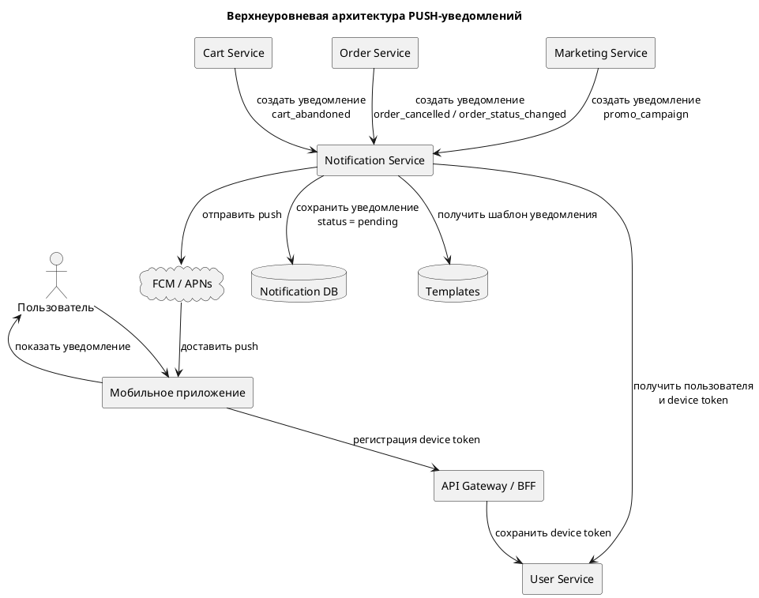

# Задание 3. Архитектура PUSH-уведомлений

## 1. Описание задачи

Необходимо построить верхнеуровневую архитектурную схему для отправки PUSH-уведомлений в мобильное приложение интернет-магазина «Петрушка Зеленая».

По условию, PUSH-уведомления могут быть разных типов:

- напоминание о товарах, которые долго лежат в корзине без действий;
- уведомление об отмене заказа;
- рекламные рассылки;
- другие уведомления, которые могут появиться позже.

На backend используется микросервисная архитектура.

---

## 2. Основная идея решения

Для отправки PUSH-уведомлений предлагается выделить отдельный `Notification Service`.

Бизнес-сервисы не должны самостоятельно отправлять PUSH в мобильное приложение. Вместо этого они передают в `Notification Service` данные о событии, по которому нужно создать уведомление.

`Notification Service` отвечает за:

- получение заявки на отправку уведомления;
- определение пользователя-получателя;
- получение актуального device token пользователя;
- выбор шаблона уведомления;
- сохранение уведомления и статуса отправки;
- отправку PUSH через внешний push-провайдер;
- обработку ошибок и повторные попытки отправки.

В качестве внешнего push-провайдера может использоваться FCM для Android и APNs для iOS.

---

## 3. Компоненты архитектуры

| Компонент | Назначение |
|---|---|
| `Mobile App` | Получает device token от FCM/APNs, передает его на backend и отображает PUSH-уведомления пользователю |
| `API Gateway / BFF` | Принимает запросы от мобильного приложения и передает их во внутренние сервисы |
| `User Service` | Хранит данные пользователя и активные device token |
| `Cart Service` | Формирует событие для уведомления о брошенной корзине |
| `Order Service` | Формирует события по заказам: отмена заказа, изменение статуса заказа |
| `Marketing Service` | Формирует рекламные PUSH-уведомления |
| `Notification Service` | Центральный сервис для подготовки и отправки PUSH-уведомлений |
| `Notification DB` | Хранит уведомления, статусы отправки, ошибки и историю попыток |
| `Templates` | Хранит шаблоны текстов уведомлений |
| `FCM / APNs` | Внешние push-провайдеры для доставки уведомлений на устройство пользователя |

---

## 4. Верхнеуровневая схема

NotificationService --> NotificationDB: обновить статус отправки\nsuccess / failed / retry_pending

@enduml
